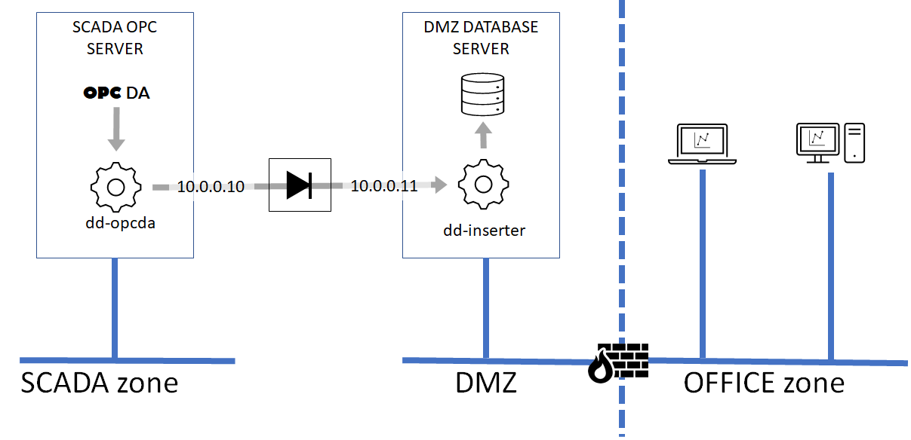
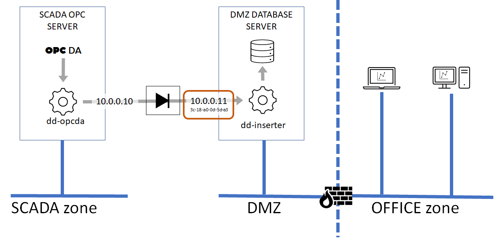

# Example data-diode configuration on Windows


Based on the high level diagram from before, a typical configuration would involve to hosts. One acting as OPC server and inner data pump, and the other acting timeseries database and outer data pump.

This example will assist you to set up:
- an OPC server host to run ```dd-opcda``` as a Windows service collecting specific tags (inner host)
- a Timescale database server host and the ```dd-inserter``` receiver as a Windows service (outer host)
- dedicated network interfaces on inner and outer hosts to be used with the data-diode
- the inner host to forward packets to the outer host through the data-diode

From a data sensitivity perspective, the more sensitive network is the one where the OPC server is located. This network is called 'inner', and the OPC server is called the 'inner host'

The less sensitive network, typically an office network or a DMZ accessible from the office network is called the 'outer' network, and the Timescale database host we're about to set up to receive data from the inner host is called the 'outer host'.

Instructions on how to set up the inner host is found in the [dd-inserter](https://github.com/cyops-se/dd-inserter) repository

## Setting up the existing OPC server host

### Setting up an ARP entry for the outer host
The dd-opcda application use UDP to forward data to the outer host, which mean the outer network address must have a hardware (MAC) address associated with it. Normally, the IP to MAC translation is made automatically in the background between the two hosts (if they were connected to the same network) by the network protocol ARP (Address Resolution Protocol). This is not possible with a data-diode in between since the ARP reply from the outer host cannot be transferred back to the inner host (who made the ARP request).

There are different ways of manipulating the ARP table of a host, but in this case the inner host must be autonomous in which case we have to add a persistent ARP entry to the inner host manually (also called static ARP entry). To do this you need the IP and MAC address of the network interface on the outer host that is connected to the outer side of the diode. You also need administrator privileges on the inner host.

### Find MAC address of outer network interface

Begin with opening a command prompt in the **outer** host and issue the following command
```
ipconfig /all
```
It will print information about all network interfaces available in the host. There are two network interfaces in the example below, one that connects to the SCADA production network `(172.46.21.132/22)`, and one used to connect to the data-diode `(10.0.0.11/24)`. We are looking for the MAC address for the 10.0.0.10 interface (called physical address in Windows speak).

```
C:\>ipconfig /all

Windows IP Configuration

   Host Name . . . . . . . . . . . . : [hostname]
   Primary Dns Suffix  . . . . . . . :
   Node Type . . . . . . . . . . . . : Hybrid
   IP Routing Enabled. . . . . . . . : No
   WINS Proxy Enabled. . . . . . . . : No
   DNS Suffix Search List. . . . . . : localdomain

Ethernet adapter SCADAnet:

   Connection-specific DNS Suffix  . : localdomain
   Description . . . . . . . . . . . : Intel(R) Ethernet Connection I217-V
   Physical Address. . . . . . . . . : FC-AA-14-91-A4-B3
   DHCP Enabled. . . . . . . . . . . : No
   Autoconfiguration Enabled . . . . : Yes
   IPv4 Address. . . . . . . . . . . : 172.46.21.132(Preferred)
   Subnet Mask . . . . . . . . . . . : 255.255.252.0
   Default Gateway . . . . . . . . . : 
   DNS Servers . . . . . . . . . . . : 172.20.96.10
   NetBIOS over Tcpip. . . . . . . . : Enabled

Ethernet adapter DIODEnet:

   Connection-specific DNS Suffix  . : localdomain
   Description . . . . . . . . . . . : Targus Ethernet
   Physical Address. . . . . . . . . : 3C-18-A0-0D-5D-A3
   DHCP Enabled. . . . . . . . . . . : No
   Autoconfiguration Enabled . . . . : Yes
   IPv4 Address. . . . . . . . . . . : 10.0.0.11(Preferred)
   Subnet Mask . . . . . . . . . . . : 255.255.255.0
   Default Gateway . . . . . . . . . : 
   DNS Servers . . . . . . . . . . . : 
   NetBIOS over Tcpip. . . . . . . . : Enabled
```

From this information we can find that the MAC address for the data diode network interface in the **outer** host is **3C-18-A0-0D-5D-A3** in this case. 

Now that we now both the IP and MAC addresses of the data-diode interface in the **outer** host, we can add a static ARP entry in the **inner** host.

Move over to the inner host, open up a command shell (PowerShell or cmd doesn't matter) as administrator and issue the following command (assuming that the **inner** host data diode network interface is called 'DIODEnet' the same way as in the **outer** host):

```
netsh interface ipv4 set neighbors Interface="DIODEnet" address=10.0.0.10 neighbor=3c-18-a0-0d-5d-a3 store=persistent
```

Note that the MAC address is called '```neighbor```' in ```netsh``` command!

Running '```arp -a```' should reveal the new entry for the correct

## Installing dd-opcda as Windows service

Start a command prompt (cmd) or powershell terminal as Administrator (or as a user with privileges to install new services) and navigate to the directory where the dd-opcda executable is located.

Run the following command:

```
.\dd-opcda -cmd install
```

This will create a new service entry. Now open the services management console (services.msc) and find 'dd-opcda from cyops-se'. Change start method and account information if needed. Start method must be changed to **Automatic** for the service to start automatically after a system reboot, and the account under which the service runs must be permitted to access the OPC DA server.

To remove the service, just run the following command as Administrator:

```
.\dd-opcda -cmd remove
```
