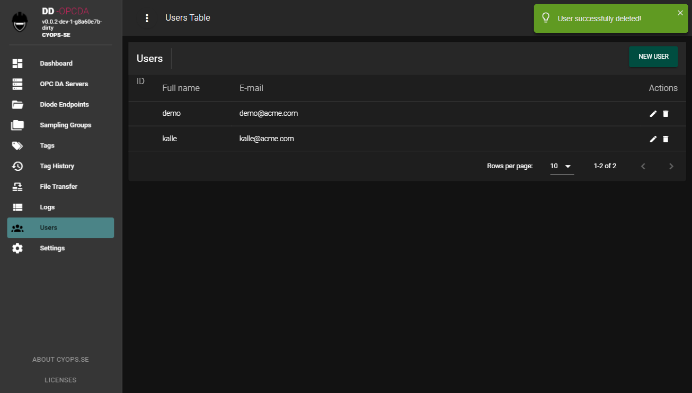

# dd-opcda - User Interface
**cyops-se**: *This application is part of the cyops.se community and use the same language and terminology. If there are acronyms or descriptions here that are unknown or ambiguous, please visit the [documentations](https://github.com/cyops-se/docs) site to see if it is explained there. You are welcome to help us improve the content regardless if you find what you are looking for or not*.

# Table of Contents
* [Register new user](#register-new-user)
* [Dashboard](#dashboard)
* [Diode endpoints](#diode-endpoints)
* [Sampling groups](#sampling-groups)
* [OPC DA servers](#opc-da-servers)
* [Tag browser](#tag-browser)
* [Tags](#tags)
* [Tag history](#tag-history)
* [File transfer](#file-transfer)
* [Logs](#logs)
* [Users](#users)
* [Settings](#settings)

A simple user interface is provided to configure, operate and monitor the application health. After the application is started from an account with persmissions to access the local OPC DA servers, use a modern web browser (not Internet Explorer) to access http://localhost:3000


There is no default user and it is possible to register new users without any separate approval. Click the 'Register here' link to get to the new user registration page.

# Register new user


The users in this application are currently not used for anything, but is provided in preparation of future improvements.

Register a bogus user with information that is easy to remember and that is not used for any real accounts.

You will be redirected the Login page where you can enter the e-mail and password you just registered. A successful login will bring you to the Dashboard page.

# Dashboard


The dashboard is empty from the beginning, but will show current status of defined sampling groups. The next step is to define an end-point and default sampling group.

# Diode endpoints


A diode end-point represents the receiver on the other side of the data diode and is used to associate sampling groups with a target receiver, making it possible to forward different tags through different data-diodes if there are more than one. However, ***the application currently only support a single end-point***.

Use the **NEW END-POINT** button to add a new end-point using the dialog that pops up.

| Field | Description |
|-------|-------------|
| Name | Can be anything that helps you identify the end-point. This value is shown in other dialogs that associate with end-points |
| Description | Optional field that can be used to save details about the end-point configuration, like **netsh** commands etc. |
| Endpoint IP | This IP address must math the receiving interface on the other side of the data diode (which is 10.0.0.11 in the provided example). |
| Meta data port | UDP destination port used for meta data. **Meta data is currently not supported** |
| Process data port | UDP destination port for data collected from OPC DA. This is the primary port used by ```dd-inserter``` to receive and process the data at the receiving end. **The receiving host must allow this port through the local host based filter for this function to work.** |
| File transfer port | UDP destination port for file transfer. This is the primary port used by ```dd-inserter``` to receive files. **The receiving host must allow this port through the local host based filter for this function to work.** |

# Sampling groups


Sampling groups allow different tags to be sampled at different frequencies and potentially be sent through different data diodes or to different end-point hosts. Tags to be sampled are associated with one group each (it is not possible to include the same tag in different groups). Each group can hold several tags.

Use the **NEW GROUP** button to add a new group using the dialog that pops up.

| Field | Description |
|-------|-------------|
| Name | Can be anything that helps you identify the group. This value is shown in other dialogs that associate with groups |
| Sampling Interval | The frequence in seconds that data will be sampled from the OPC DA server for this group. |
| Server ProgID | The OPC DA server associated with tags in this group. |
| Endpoint | The end-point defined previously following the instructions in the [End-point](#Endpoint) section |
| Start automatically | Inidicates if sampling should start automatically after the application is restarted, for example if it is runnung as a service and the host is rebooted. |
| Default group | Valid for a single group at a time and is used by the [tag browser](#Tagbrowser) to associate tags being selected to avoid unecessary editing of inidividual tags afterwards. If you have several groups, make sure to change the default group to the intended one before adding tags. |
| Description | Optional field for user comments |

# OPC DA Servers


This view simply lists all OPC DA servers that could be identified by the application. If this list is empty and you are certain there is at least one OPC DA server in the same host as the application is running in, please check for which architecture (32- or 64-bit) the OPC DA server is intended and use the appropriate executable (or rebuild using GOARCH=386 resp GOARCH=amd64 environment variable values).

Click on the magnifier at the right for the OPC DA server you want to sample data from to get to the tag browser.

# Tag browser


**NOTE! Please observe the information on tag path delimiters before you start adding tags! If the delimiter is not correct, the added tags will not be collected and have to be deleted and added again after the delimiter is configured properly! See section [settings](#Settings) for more information regarding tag path delimiters**.

The tag browser the you reach by clicking on the magnifier in the OPC DA server view is useful when you have very small OPC trees, to troubleshoot tag paths or to get an import template, but is typically not suitable for larger OPC trees. For larger amounts of tags where the path is known, consider using the tag import feature mentioned below instead.

To select tags for collection, simply 'check' them and 'uncheck' them to remove them from the sampling group. Removing tags is also possible from the [Tags](#Tags) view.

# Tags

Tags selected using the [tag browser](#Tagbrowser) show up in this list from where it is possible to remove them or change group.

From this view, it is possible to export and import tags in a very simple CSV format. An export (using the **EXPORT TO CSV** button) of the example list in the screenshot above will look like:

```
name;groupid;
Random/Real8;1;
Random/Real4;1;
```

Lets add two tags that we know exist in the server (verify using the tag browser):

```
name;groupid;
Random/Real8;1;
Random/Real4;1;
Writable/Real8;1;
Writable/Real4;1;
```

Click **IMPORT FROM CSV** and drop the file in the dialog that pops up.


Click the **up arrow** to import the content for review before committing it to the configuration.


New and changed items are shown (unchanged items are filtered out) and the **SAVE CHANGES** button is activated. If the changes looks ok, click **SAVE CHANGES** to commit them (you may have to refresh the page to see the full list again).


# Tag history


This feature stores messages already sent through a diode to local disk in the event it has to be resent, for example if a packet is lost or if the reciever is not available for some reason.

The default retention period is 7 days, but this parameter can be modified in the [settings](#Settings) section. Messages are stored in 5 minute intervals, and the search function is efficient to find specific periods in time that need to be resent.


Checking the files that represents the timespan that should be resent and clicking **SEND AGAIN** will copy the selected files to a certain outgoing file transfer folder used by ```dd-inserter``` on the receiving side to auto-commiting them.

# File transfer


This feature is used to transer files from the sensitive network through a data diode. There are two ways files can be transferred. Either by using the **UPLOAD FILE** button and drag a file onto the upload dialog (and click the 'up arrow') or by putting the file or directory in the outgoing/new folder dd-opcda wording directory.

Files are transferred one at a time, and the progress of the currently transferred file is shown in the user interface.


# Logs


Simple log view listing all events in the system. Use the search feature to filter out events of interest and use column sorting e.g. to get the timeline in ascending or descending order.
**CLEAR ALL ENTRIES** wipes the log clean.



Simple list of registered users. It is possible to change name and e-mail for existing users or remove them from the system. There is currently no permissions or access rights associated, nor is there any audit logs.

# Settings


| Setting | Description |
|---------|-------------|
| tagpathdelimiter | **IMPORTANT**: Collection of tags will not work unless this parameter is correct. Common delimiters are '.' and '/' but there may be others. For ABB 800xA, the delimiter is '.', but it is '/' for the Integration Objects simulation server. Default for dd-opcda is '.'. This setting must be correct before tags are added to groups using either the tag browser or the tag import.
| cacheretention | Determines the number of days messages should be stored locally in case they need to be resent |
| filetransfer.modulus | Depending on network architecture and capabilities of the receiving host it may be necessary to slow down the number of packets sent per second to avoid packet loss. This value determine how many packets to send before pausing a number of milliseconds (defined by another setting) |
| filetransfer.msdelay | Determines how long the pause should be in milliseconds between batches of packets (batch size determined by filetransfer.modulus) |